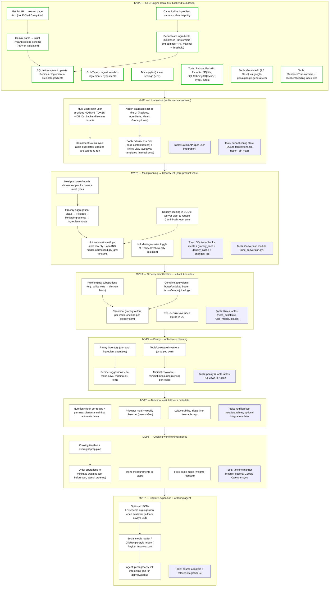

```mermaid
flowchart TB

%% =========================
%% MVP ROADMAP (Mermaid Chart compatible)
%% =========================

subgraph MVP0["MVP0 — Core Engine (local-first backend foundation)"]
  direction TB
  mvp0_f1["Fetch URL → extract page text (no JSON-LD required)"]:::feature
  mvp0_f2["Gemini parse → strict Pydantic recipe schema (retry on validation)"]:::feature
  mvp0_f3["Canonicalize ingredient names + alias mapping"]:::feature
  mvp0_f4["Deduplicate ingredients (SentenceTransformers embeddings + NN matcher + threshold)"]:::feature
  mvp0_f5["SQLite idempotent upserts: Recipes / Ingredients / RecipeIngredients"]:::feature
  mvp0_f6["CLI (Typer): ingest, reindex-ingredients, sync-meals"]:::feature
  mvp0_f7["Tests (pytest) + env settings (.env)"]:::feature

  mvp0_t1["Tools: Python, FastAPI, Pydantic, SQLite, SQLAlchemy/SQLModel, Typer, pytest"]:::tool
  mvp0_t2["Tools: Gemini API (2.5 Flash) via google-genai/google-generativeai"]:::tool
  mvp0_t3["Tools: SentenceTransformers + local embedding index files"]:::tool
end

subgraph MVP1["MVP1 — UI in Notion (multi-user via backend)"]
  direction TB
  mvp1_f1["Notion databases act as the UI (Recipes, Ingredients, Meals, Grocery Lines)"]:::feature
  mvp1_f2["Multi-user: each user provides NOTION_TOKEN + DB IDs; backend isolates tenants"]:::feature
  mvp1_f3["Backend writes: recipe page content (steps) + linked view layout via templates (manual once)"]:::feature
  mvp1_f4["Idempotent Notion sync: avoid duplicates; updates are safe to re-run"]:::feature

  mvp1_t1["Tools: Notion API (per-user integration)"]:::tool
  mvp1_t2["Tools: Tenant config store (SQLite tables: tenants, notion_db_map)"]:::tool
end

subgraph MVP2["MVP2 — Meal planning → Grocery list (core product value)"]
  direction TB
  mvp2_f1["Meal plan week/month: choose recipes for dates + meal types"]:::feature
  mvp2_f2["Include-in-groceries toggle at Recipe level (weekly selection)"]:::feature
  mvp2_f3["Grocery aggregation: Meals → Recipes → RecipeIngredients → Ingredients totals"]:::feature
  mvp2_f4["Unit conversion rollups: store raw qty+uom AND hidden normalized qty_gml for sums"]:::feature
  mvp2_f5["Density caching in SQLite (server-side) to reduce Gemini calls over time"]:::feature

  mvp2_t1["Tools: SQLite tables for meals + grocery_lines + density_cache + changes_log"]:::tool
  mvp2_t2["Tools: Conversion module (unit_conversion.py)"]:::tool
end

subgraph MVP3["MVP3 — Grocery simplification + substitution rules"]
  direction TB
  mvp3_f1["Rule engine: substitutions (e.g., white wine → chicken broth)"]:::feature
  mvp3_f2["Combine equivalents: butter/unsalted butter; lemon/lemon juice logic"]:::feature
  mvp3_f3["Canonical grocery output per week (one line per grocery item)"]:::feature
  mvp3_f4["Per-user rule overrides stored in DB"]:::feature

  mvp3_t1["Tools: Rules tables (rules_substitute, rules_merge, aliases)"]:::tool
end

subgraph MVP4["MVP4 — Pantry + tools-aware planning"]
  direction TB
  mvp4_f1["Pantry inventory (on-hand ingredient quantities)"]:::feature
  mvp4_f2["Tools/cookware inventory (what you own)"]:::feature
  mvp4_f3["Recipe suggestions: can-make-now / missing ≤ N items"]:::feature
  mvp4_f4["Minimal cookware + minimal measuring utensils per recipe"]:::feature

  mvp4_t1["Tools: pantry & tools tables + UI views in Notion"]:::tool
end

subgraph MVP5["MVP5 — Nutrition, cost, leftovers metadata"]
  direction TB
  mvp5_f1["Nutrition check per recipe + per meal plan (manual-first, automate later)"]:::feature
  mvp5_f2["Price per meal + weekly plan cost (manual-first)"]:::feature
  mvp5_f3["Leftoverability, fridge time, freezable tags"]:::feature

  mvp5_t1["Tools: nutrition/cost metadata tables; optional integrations later"]:::tool
end

subgraph MVP6["MVP6 — Cooking workflow intelligence"]
  direction TB
  mvp6_f1["Cooking timeline + overnight prep plan"]:::feature
  mvp6_f2["Inline measurements in steps"]:::feature
  mvp6_f3["Order operations to minimize washing (dry before wet, utensil ordering)"]:::feature
  mvp6_f4["Food-scale mode (weights-focused)"]:::feature

  mvp6_t1["Tools: timeline planner module; optional Google Calendar sync"]:::tool
end

subgraph MVP7["MVP7 — Capture expansion + ordering agent"]
  direction TB
  mvp7_f1["Optional JSON-LD/schema.org ingestion when available (fallback always text)"]:::feature
  mvp7_f2["Social media reader / ClipRecipe-style import / AnyList import-export"]:::feature
  mvp7_f3["Agent: push grocery list into online cart for delivery/pickup"]:::feature

  mvp7_t1["Tools: source adapters + retailer integration(s)"]:::tool
end

%% =========================
%% DEPENDENCIES (MVP order)
%% =========================
MVP0 --> MVP1 --> MVP2 --> MVP3 --> MVP4 --> MVP5 --> MVP6 --> MVP7

%% Within-MVP feature dependencies (key ones)
mvp0_f1 --> mvp0_f2 --> mvp0_f5
mvp0_f3 --> mvp0_f4 --> mvp0_f5

mvp1_f2 --> mvp1_f4
mvp1_f1 --> mvp1_f3

mvp2_f1 --> mvp2_f3 --> mvp2_f4
mvp2_f5 --> mvp2_f4

mvp3_f1 --> mvp3_f3
mvp3_f2 --> mvp3_f3

mvp4_f1 --> mvp4_f3
mvp4_f2 --> mvp4_f4

mvp6_f1 --> mvp6_f3

mvp7_f1 --> mvp7_f2 --> mvp7_f3

%% =========================
%% STYLES
%% =========================
classDef feature fill:#ffffff,stroke:#888,stroke-width:1px,color:#111;
classDef tool fill:#eef,stroke:#55a,stroke-width:1px,color:#111;
classDef implemented fill:#ffffff,stroke:#0a0,stroke-width:2px,color:#111;

class mvp0_f1,mvp0_f2,mvp0_f3,mvp0_f4,mvp0_f5,mvp0_f6,mvp0_f7 implemented;
class mvp0_t1,mvp0_t2,mvp0_t3 implemented;
```